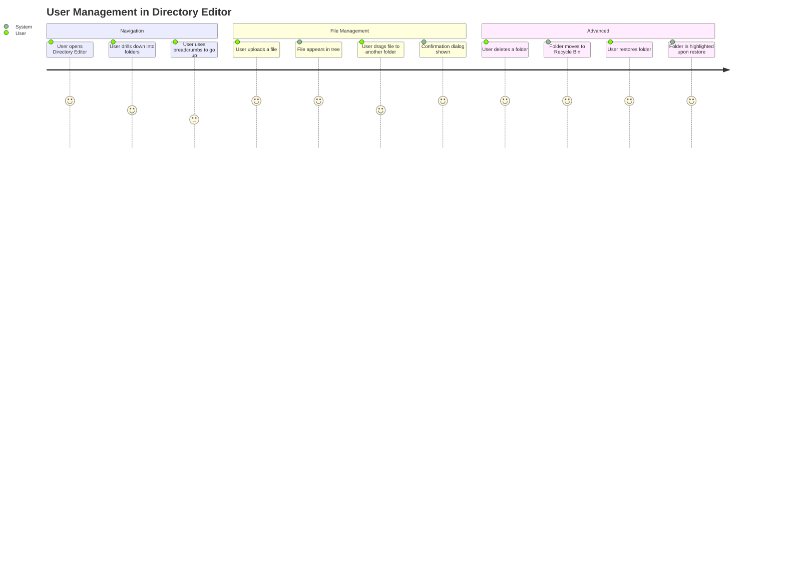

### 4. DirectoryEditor.tsx

**Purpose:**  
The `DirectoryEditor.tsx` file implements the main **BrightSourceTree** component, which provides a robust, interactive interface for navigating, organizing, and managing a hierarchical directory of folders and documents. It supports advanced features such as drag-and-drop, context menus, file and folder CRUD, a recycle bin, multi-select, breadcrumbs, sorting, uploading, and keyword management.

---

#### 4.1 Core Concepts and Models

- **DirectoryItem**: The base model representing an item in the tree (either a `Folder` or `Document`).  
- **Folder**: Extends `DirectoryItem`, may contain a list of child items, and supports nested structure and folder-specific operations.  
- **Document**: Extends `DirectoryItem`, represents a file, and supports file-specific operations.
- **DocType**: Enum designating `'dir'` (folder) or `'file'`.
- **Recycle Bin**: A synthetic folder that aggregates all deleted items for possible restoration or purging.

---

#### 4.2 Features and Data Flows

##### Directory and Tree Data Management

- **MobX State Synchronization**: The component observes the MobX `BrightSource.Directory.allItems` state. Any update (such as from cloud sync or CRUD operations) triggers a re-calculation and re-render of the tree UI.
- **Filtering & Virtual Folders**:  
  - Deleted items are filtered from normal folder views.
  - The Recycle Bin is built dynamically from all deleted items and appended to the root, ensuring deleted items are always accessible for restore.

##### Navigation and Breadcrumbs

- **Drill-down Navigation**:  
  - Clicking a folder drills down, updating the `pathStack` to represent the navigation path and showing only that folder’s contents.
  - The breadcrumb component allows users to jump to any hierarchy level, updating the view accordingly.
- **Go Up Functionality**:  
  - Users can move up one level in the hierarchy using the toolbar or breadcrumb, popping the last folder from `pathStack`.

##### CRUD Operations

- **Create Folder**:  
  - New folders are created under the currently navigated folder unless in the Recycle Bin.
  - The system ensures unique folder names using a name conflict resolver.

- **Rename**:  
  - Both folders and files can be renamed in-place.  
  - Uses an inline editor, with validation, and updates state/cloud storage upon completion.

- **Delete/Recycle**:  
  - Deletes move items (files/folders) to the Recycle Bin, instead of permanent deletion.
  - Confirmation dialogs prevent accidental moves.

- **Restore**:  
  - Items in the Recycle Bin can be restored to their original location.
  - "Restore All" is supported for bulk recovery.

##### Drag-and-Drop

- **Drag Files/Folders**:  
  - Users can move items within the hierarchy using drag-and-drop.
  - Moves are confirmed with dialogs, and special logic prevents invalid moves (e.g., into the Recycle Bin or into themselves).

##### Multi-Select and Bulk Actions

- **Multi-Select**:  
  - TreeView allows multiple selection for batch operations (move, delete, restore).
  - Bulk confirmation dialogs provide safety and clarity.

##### Sorting

- **Custom Sorting**:  
  - The component supports sorting by name, type, or docType, and in ascending or descending order.
  - The Recycle Bin is always sorted to a fixed position (usually the end).

##### Upload

- **Upload Integration**:  
  - A dialog with an integrated custom uploader allows users to upload files directly into the currently navigated folder.
  - After upload, metadata and cloud storage are synced, and optional notifications are sent.

##### Context Menu

- **Dynamic Context Menu**:  
  - Right-clicking on nodes provides context-sensitive actions including rename, delete, move, keywords, version history, and AI-related actions.
  - Menu items are dynamically generated based on node type, permissions, and current context (e.g., whether in the Recycle Bin).

##### Keyword and Metadata Management

- **Keyword Dialog**:  
  - Users can edit keywords associated with any file or folder, aiding in search and AI operations.
  - Keywords are saved directly to the item's metadata.

---

#### 4.3 Key Functions and Logic

- **findNodeById**: Recursively searches the tree for a node by `id`, with special handling for the Recycle Bin.
- **getNextAvailableName**: Ensures unique folder names within the current directory.
- **collectDeletedItems / createRecycleBinFolder**: Gathers all deleted items to build the synthetic Recycle Bin.
- **sortItems**: Sorts items according to the currently selected criterion.
- **buildPathStackToFolder**: Calculates the full navigation stack required to reach a given folder, used for accurate breadcrumbs and restoring tree state after operations.
- **addItem**: Handles file uploads, including blob storage, metadata creation, progress tracking, and keyword assignment.
- **moveItemUpOneLevel / moveItemToRoot**: Moves a node one level up or to the root, with confirmation and error handling.
- **toggleItemVisibility**: Hides or unhides items in the UI based on user command.

---

#### 4.4 UI State and Dialog Management

- **Dialog States**:  
  - Multiple confirmation dialogs are managed for move, delete, restore, restore-all, and bulk actions.
- **Selected Item State**:  
  - The currently selected or acted-upon item is tracked for context menu and dialog usage.
- **Highlighting**:  
  - Restored items are visually highlighted for a short period to aid user orientation.

---

#### 4.5 Data & Event Flow: Directory Editor

```mermaid
flowchart LR
  A["Firebase Store: BrightSource.Directory.allItems"] --> B["useMemo ➔ brightSourceData (filtered)"];
  B --> C["useEffect ➔ rootTree + recycleBin"];
  C --> D["setTreeData based on pathStack"];
  D --> E["TreeViewComponent renders treeData"];
  E --> F["User interaction"];
  F --> G["Event handlers (selection, drag, menu...)"];
  G --> H["Folder/Document CRUD via Firebase methods"];
  H --> I["BrightSource.Directory.load() ➔ Firebase Store: BrightSource.Directory.allItems"];
```

---

#### 4.6 Component Interaction Highlights

- **Syncfusion TreeView**: Central UI component, configured for drag-and-drop, editing, multi-selection, and custom node rendering.
- **Dialogs and Forms**: Material-UI dialogs for confirmations and keyword editing.
- **Toolbar**: Provides navigation (up, upload, new folder), sorting, and bulk actions.
- **Uploader Dialog**: Integrates tightly with the current navigation context, ensuring uploads are correctly placed.
- **Snackbar Notifications**: Used throughout for user feedback on successful or failed actions.

---

#### 4.7 User Journey Example

---

**Summary:**  
The Directory Editor is a comprehensive, enterprise-level file management component combining modern React architecture, MobX state, a powerful third-party TreeView, and deep cloud integration. Its design ensures all common and advanced directory operations are accessible, safe, and discoverable through an intuitive UI and robust workflow logic.