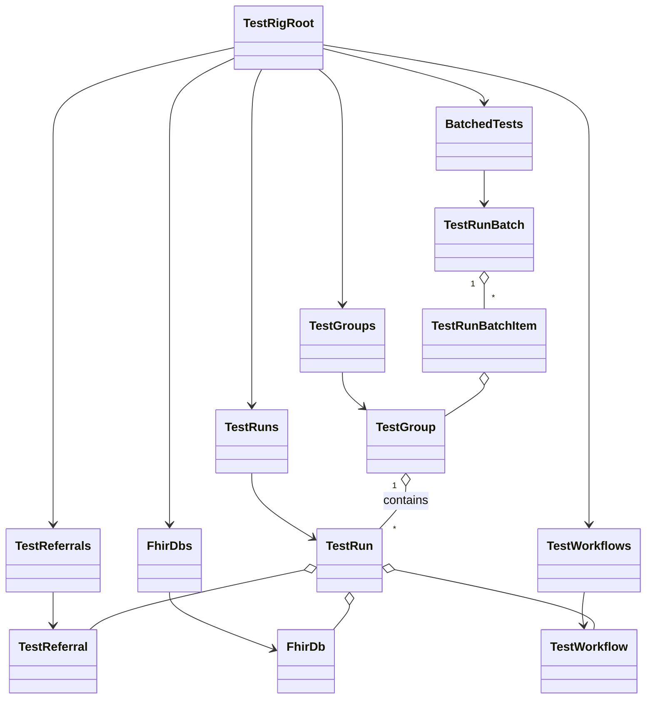

# TestRig 📊 Documentation

Welcome to the **TestRig** documentation! This guide provides a comprehensive overview of the data models, stores, and UI components that power the TestRig application. We’ll explore how test runs are defined, scheduled, grouped, stored, and displayed.

---

## 📑 Index

1. [Overview](#overview)  
2. [Data Models](#data-models)  
   2.1 [Types.ts](#typests)  
   2.2 [TestFormat & TestWorkflowCategories](#testformat--testworkflowcategories)  
   2.3 [PageCanvas.ts](#pagecanvasts)  
   2.4 [TestReferral & TestReferrals.ts](#testreferral--testreferralsts)  
   2.5 [FhirDb & FhirDbs.ts](#fhirdb--fhirdbsts)  
   2.6 [TestWorkflow & TestWorkflows.ts](#testworkflow--testworkflowsts)  
   2.7 [TestRunStats & TestRun.ts](#testrunstats--testrunts)  
   2.8 [TestGroupStats & TestGroup.ts](#testgroupstats--testgroupts)  
   2.9 [TestRunBatch.ts](#testrunbatchts)  
   2.10 [UserSettingsCache.ts](#usersettingscachets)  
3. [Stores & Root TestRig](#stores--root-testrig)  
   3.1 [TestGroups.ts](#testgroupsts)  
   3.2 [TestRuns.ts](#testrunsts)  
   3.3 [Root-TestRig.ts](#root-testrigts)  
4. [UI Components](#ui-components)  
   4.1 [Page_TestGroups.tsx](#page_testgroupstsx)  
   4.2 [Table_TestGroup.tsx & TestGroup.tsx](#table_testgrouptsx--testgrouptsx)  
   4.3 [Page_TestRuns.tsx](#page_testrunstsx)  
   4.4 [Table_TestRuns.tsx](#table_testrunstsx)  
   4.5 [Panel_TestRuns.tsx](#panel_testrunstsx)  
   4.6 [Panel_TestRunBatch.tsx](#panel_testrunbatchtsx)  
   4.7 [styles.css](#stylescss)  
5. [Utilities](#utilities)  
   5.1 [TestRigTabs.ts](#testrigtabsts)  
6. [Class Diagram](#class-diagram)  

---

## 1. Overview

TestRig is a **MobX**-powered React application for orchestrating and visualizing test runs against FHIR‐based data.  
- **Data Models** define tests, workflows, referrals, and execution stats.  
- **Stores** load and persist data via Firestore.  
- **UI Components** provide pages and panels for listing, creating, and managing tests.  

At the heart is `TestRigRoot`, which ties together sub-stores for referrals, databases, workflows, groups, runs, and batch workflows.

---

## 2. Data Models

### 2.1 Types.ts

Defines core enums and interfaces used across models.

| Name             | Type               | Description                            |
|------------------|--------------------|----------------------------------------|
| `ValidationError` | interface          | `{ field: string; message: string; }`  |
| `ValidationResult` | interface         | `{ isValid: boolean; errors: ValidationError[]; }` |
| `TestFormat`     | enum               | Document vs. Pages vs. Page            |
| `TestStatus`     | enum               | PENDING, RUNNING, PASSED, FAILED, ERROR |
| `LoadStatus`     | enum               | Loading state of stores               |
| `UserSettingsCache` | interface        | Cache structure for user defaults      |

```typescript
export enum TestStatus {
  Pending = 'PENDING',
  Running = 'RUNNING',
  Passed = 'PASSED',
  Failed = 'FAILED',
  Errored = 'ERROR'
}
```

---

### 2.2 TestFormat.ts & TestWorkflowCategories.ts

- **TestFormat.ts**: mirrors `Types.ts` `TestFormat` enum (Document/Pages/Page).  
- **TestWorkflowCategories.ts**: static collection of production/development categories.

```typescript
export enum TestFormat {
  DOCUMENT = 'Document',
  PAGES = 'Pages',
  Page = 'Page',
}
```

| Class                  | Purpose                                       |
|------------------------|-----------------------------------------------|
| `TestWorkflowCategory` | Metadata for categorizing workflows          |
| `TestWorkflowCategories` | Singleton list: Production & Development |

---

### 2.3 PageCanvas.ts

Represents individual pages of a referral document.

- **`PageInfo`**: Metadata (name, index, URL, size).  
- **`PageCanvas`**: Contains rendered canvas, text, word count, and a Firebase storage reference.

```typescript
export class PageInfo {
  name: string;
  pageIndex: number;
  pageNumber: number;
  pageType: string;
  pageUrl: string;
  size: number;
  constructor(dbItem: any) { /* … */ }
}
```

---

### 2.4 TestReferral & TestReferrals.ts 📄

Models a document referral (PDF + Excel) with pagination.

| Class               | Key Props                              |
|---------------------|----------------------------------------|
| `TestReferral`      | `id, name, docUrl, excelUrl, pageCount, pages:PageInfo[]` |
| `TestReferrals`     | MobX collection; loads/saves via Firestore |

```typescript
export class TestReferral {
  id: string;
  org: Organization;
  docUrl: string;
  excelUrl: string;
  pageCount: number;
  pages: PageInfo[] = [];
  /* validation, makeAutoObservable */
}
```

---

### 2.5 FhirDb & FhirDbs.ts 🏥

Models a FHIR database endpoint.

| Class      | Key Props                           |
|------------|-------------------------------------|
| `FhirDb`   | `id, name, gcpPath, gcpLink, org`   |
| `FhirDbs`  | MobX collection; Firestore CRUD     |

Validation ensures `id`, `name`, and `gcpPath` are set.

---

### 2.6 TestWorkflow & TestWorkflows.ts 🤖

Defines external AI workflows invoked per test.

| Class         | Key Props                                  |
|---------------|---------------------------------------------|
| `TestWorkflow`| `id, name, webhook, isEnabled, isProduction` |
| `TestWorkflows`| MobX collection; Firestore CRUD            |

```typescript
export class TestWorkflow {
  private _name: string;
  private _webhook: string;
  private _isEnabled: boolean;
  private _isProduction: boolean;
  /* validation, clone, save() */
}
```

---

### 2.7 TestRunStats & TestRun.ts 🏃‍♂️

Captures one execution of a referral through a workflow & DB.

| Class            | Description                                      |
|------------------|--------------------------------------------------|
| `TestRunStats`   | `{ test: {passed,failed,…}, workflows: {count,…} }` |
| `TestRun`        | Core model for a single run                      |

**Key props of `TestRun`:**

- `id, org, referral, workflow, db, format, pages[]`  
- Timestamps: `startedOn, endedOn, duration`  
- `status: TestStatus`  
- `displayData: ComparisonDisplayData` (shared UI state)  
- **MobX**: `makeAutoObservable(this)`

```typescript
export class TestRun {
  id: string;
  org: Organization;
  referral: TestReferral;
  workflow: TestWorkflow;
  db: FhirDb;
  format: TestFormat;
  pages: number[];
  status: TestStatus = TestStatus.Pending;
  stats: TestRunStats = new TestRunStats();
  /* constructors, validate(), save(), clone(), … */
}
```

---

### 2.8 TestGroupStats & TestGroup.ts 📦

Aggregates multiple runs of the *same* configuration.

| Class            | Description                                  |
|------------------|----------------------------------------------|
| `TestGroupStats` | `{ tests: {current,total}, workflows: {...} }` |
| `TestGroup`      | Clusters runs by referral+workflow+pages    |

**Key props:**

- `id, referral, workflow, db, format, pages[]`  
- `testRuns: TestRun[]`, `testRunIds[]`  
- `stats: TestGroupStats`  
- UI & persistence methods: `save()`, `archive()`, `delete()`, `rerun()`

```typescript
export class TestGroup {
  id: string;
  referral: TestReferral;
  workflow: TestWorkflow;
  db: FhirDb;
  pages: number[];
  testRuns: TestRun[] = [];
  status: TestStatus = TestStatus.Pending;
  stats: TestGroupStats = new TestGroupStats();
  /* constructors, validate(), rerun(), … */
}
```

---

### 2.9 TestRunBatch.ts 🔁

Defines *parallel* execution of multiple TestGroups.

| Class                   | Purpose                                     |
|-------------------------|---------------------------------------------|
| `TestRunBatchItem`      | One group + runCount in a batch             |
| `TestRunBatch`          | Collection of items, aggregate counts/duration |
| `BatchedTests`          | MobX collection of batches per org          |

```typescript
export class TestRunBatch {
  id: string;
  org: Organization;
  _tests: TestRunBatchItem[] = [];
  get testCount();    // sum of runCount
  get pageCount();    // sum of pages * runCount
}
```

---

### 2.10 UserSettingsCache.ts ⚙️

Skeleton for persisting UI defaults (referral, workflow, db, pages, format).  

```typescript
export class UserSettingsCache { Chat: any; TestRig: {} /* … */ }
```

---

## 3. Stores & Root-TestRig

### 3.1 TestGroups.ts

MobX store wrapping `TestGroup[]`.  
- `load(org)`, `add({testRun})`, `save()`, `delete()`, `archive()`, `getLookup()`.  
- Invoked by `TestRigRoot` and UI.

### 3.2 TestRuns.ts

MobX store wrapping `TestRun[]`.  
- `load(org)`, `save(testRun)`, `delete(ids)`, `getById()`.  
- Maintains descending sort by `endedOn`.

### 3.3 Root-TestRig.ts 🏗️

The **application root store**.  
- Maintains current `org`, `user`, `status`.  
- Contains sub-stores: `referrals`, `dbs`, `workflows`, `groups`, `testRuns`, `batchedTests`.  
- `setContext({authState, org, user})` loads all sub-stores.  
- `scheduleTestRun(test: TestRun|TestRunBatch)` orchestrates grouping or batching.  
- `getDate(isoDate)` helper for UI formatting.

---

## 4. UI Components

### 4.1 Page_TestGroups.tsx 📋

- **Route**: `/test-groups`  
- Calls `TestRigState.setContext(AuthState)`  
- Renders `<NewButton/>`, `<SearchBox/>`, and `<TestGroupTable/>`

### 4.2 Table_TestGroup.tsx & TestGroup.tsx 📑

- **`TestGroupTable`**: loops over `TestRig.tests` (groups & batches), renders each via  
- **`TestGroupComponent`**: card UI for a `TestGroup`  
  - Displays name, pages, workflow, stats (running, passed, failed), duration, menu actions (View, Rerun, Archive, Delete)  

### 4.3 Page_TestRuns.tsx 🔄

- **Route**: `/test-runs?id=<groupId>`  
- “Back” button → TestGroup list  
- Renders `<TestRunTable/>`

### 4.4 Table_TestRuns.tsx 📈

- Displays material-react-table of runs for a selected group  
- Columns: Name, Start Time, End Time, Result, ID  
- Actions: Edit, Delete (not fully wired)

### 4.5 Panel_TestRuns.tsx 📝

- **Drawer** for creating a **new** `TestRun`  
- Fields: Referral, Name, Format, Pages, Workflow, DB  
- Validation & copy-to-clipboard of run ID  
- On Save: invokes `TestRig.scheduleTestRun(newTest)`

### 4.6 Panel_TestRunBatch.tsx 🔀

- **Drawer** for defining **parallel batches** of groups  
- Select group + repetition count → adds to batch  
- Displays batched items, counts, and “Start Batched Tests”

### 4.7 styles.css 🎨

Utility CSS for form groups and batch-item styling.

---

## 5. Utilities

### 5.1 TestRigTabs.ts 🗂️

Manages **Dockview** tabs for an active `TestRun`:

| Tab                | Icon & Title            |
|--------------------|-------------------------|
| `COMPARISON`       | 📊 Data Comparison      |
| `EXCEL`            | 📝 Excel Editor         |
| `REFERRAL`         | 📄 Referral Viewer      |
| `NOTES`            | 📝 Notes                |
| `OVERVIEW`         | 🤖 AI Overview          |
| `RAW_FHIR`         | Raw FHIR                |
| `RAW_EXCEL`        | Raw Excel               |

- Adds/removes tabs based on availability of Excel/Referral files  
- Tracks visibility & active panel changes  
- Provides `focusTab()`, `enableTab()`, `disableTab()`

---

## 6. Class Diagram



---

🎉 You’re all set! Use this guide to understand the **TestRig** architecture, extend data models, or troubleshoot UI flows.